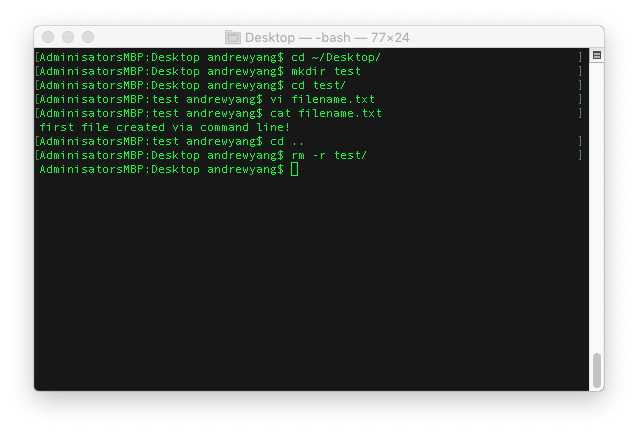

## 1.1: Overview of AI and Machine Learning

### Overview

Today's class will focus on familiarizing students with this course as well as introducing them to the evolving world of AI and machine learning (ML). The instructor, teacher assistants (TAs), student success managers (SSMs), and students will all have an opportunity to introduce themselves to the class. As part of the introduction, students will be introduced to the concept of “growth mindset” and why it will help them be successful in the course. Students will then participate in group discussions about AI and ML, and begin to use basic Terminal commands.

### Class Objectives

By the end of today's class, the students will be able to:

* Identify the instructional team and classmates.

* Understand the course format and certification requirements.

* Recall the course topics and agenda.

* Define AI and ML.

* Differentiate between AI and ML.

* Illustrate the differences between generalized and narrow AI.

---

### Instructor Notes

In this first lesson, you will warmly welcome the students to the AI Boot Camp, briefly introduce them to the world of AI and ML, and provide them with an understanding of the course layout and certification requirements. Remember to create an inviting atmosphere, encouraging students to introduce themselves and engage in discussions throughout the session.

---

### Class Slides

The slides for this lesson can be viewed on Google Drive here: [Lesson 1.1 Slides](https://docs.google.com/presentation/d/1HgeZ4Y3GET1N5Y8RbQDl3veMaiNXyUbKrgUtJsbttH8/edit#slide=id.g21f2d3f9243_0_462).

To add the slides to the student-facing repository, download the slides as a PDF by navigating to File, selecting "Download as," and then choosing "PDF document." Then, add the PDF file to your class repository along with other necessary files. You can view instructions for this [here](https://docs.google.com/document/d/1XM90c4s9XjwZHjdUlwEMcv2iXcO_yRGx5p2iLZ3BGNI/edit).

> **Note** Editing access is not available for this document. If you wish to modify the slides, create a copy by navigating to File and selecting "Make a copy...".

---

### Time Tracker

| Start Time | Number | Activity                                           | Duration |
| ---------- | ------ | -------------------------------------------------- | -------- |
| 6:30 PM | 1 | Instructor Do: Welcome to the AI Boot Camp | 0:45 |
| 7:15 PM | 2 | Instructor Do: Growth Mindset | 0:20 |
| 7:35 PM | 3 | Instructor Do: Defining AI | 0:15 |
| 7:50 PM | 4 | Everyone Do: AI Discussions | 0:15 |
| 8:05 PM | 5 | BREAK | 0:15     |
| 8:20 PM | 6 | Instructor Do: AI Foundations | 0:05 |
| 8:25 PM | 7 | Instructor Do: Terminal | 0:15 |
| 8:40 PM | 8 | Student Do: Terminal | 0:20 |
| 9:00 PM | 9 | Instructor Do: Review Terminal | 0:15 |
| 9:15 PM | 10 | Instructor Do: Wrap-up Class | 0:15 |
| 9:30 PM |      | END                                                |          |

---

### 1. Instructor Do: Welcome to the AI Boot Camp! (45 min)

This first part of the lesson will be led by the SSM. They will discuss attendance and graduation requirements, as well as share opportunities for students to get support.

During this time, everyone associated with the course will introduce themselves to break the ice and get to know each other. This includes SSMs, university staff, program directors, career coaches, the instructional staff (instructors and TAs), and the students.

Feel free to answer the questions below as a way to introduce yourself. However, be sure to keep your introduction brief, as there is a great deal to cover in this first class:

* What is your career history? Where did you start and where are you now?

* What have you accomplished thus far in your career? What is your experience with AI (if applicable)?

* What made you want to become an instructor or TA? What are you looking forward to in this course?

* What is something that defines you? What are your passions?

Share your screen and walk through the syllabus and the Canvas course so students know how to navigate it.

Make sure students understand the flow of the course&mdash;the topics that will be covered, how and when assignments are due, and how to be successful in the course.

Use the following list to guide you:

* This first module is aimed at introducing students conceptually to AI, and also to provide the technical foundations they will need to be successful later in the course.

    * Define AI and its various applications.

    * Introduce the concepts of ML and its role within the broader context of AI.

    * Differentiate between general and narrow AI.

* Before all that, we will begin by discussing the importance of a growth mindset in the field of AI.

    *AI development is highly complex and has many intersecting parts that take time to fully grasp and embrace. It is therefore important to approach this course with an open mind and eagerness to learn and improve, and not to be daunted or discouraged by the volume of work or slow progress.

---

### 2. Instructor Do: Growth Mindset (20 min)

This activity will be important to set the tone for the rest of the course.

Students are bound to be frustrated at times. The goal of this section is to tell students that frustration is a normal reaction and to establish resources to help them through it.

Frame the discussion using the following talking points:

* Imposter syndrome is a common feeling when embarking on a new learning or professional journey. It essentially means having difficulty with accepting your success, and having the tendency to doubt your abilities and achievements, and feel like a fraud.

* One of the key ways that we can battle imposter syndrome is by adopting a growth mindset.

* You may have heard the terms "fixed mindset" and "growth mindset". They were coined to describe beliefs and patterns people have about learning and intelligence.

    *  A fixed mindset occurs when one holds the belief that learning is based on innate ability. In other words, people with fixed mindsets tend to believe that abilities like intelligence and talent refers to the belief that impactful learning is based on innate ability. People with fixed mindsets believe that basic abilities, intelligence, and talent are fixed traits that you are born with. In practice, this belief is flawed and limits one's ability to learn new concepts, skills, and behaviors.

    * Growth mindset, instead, refers to the belief that impactful learning results from hard work, training, and practice. There is progression to someone’s ability based on how much time and effort they invest in it. Talents and abilities can be developed through effort and persistence, no matter where you start.

It's important to note that neither of these mindsets take into account the external factors and/or systemic barriers in place for people in many communities. They can be very narrow in scope when it comes to the reasons why people may be attempting to learn something. It is important to also consider individualized past experiences that may have made an impact on a person’s feelings towards that subject matter or learning style.

Continue through the next few slides and emphasize the following points:

* Embrace your inner toddler. Recognizing how little you know is the first step toward growth as a learner. Hard work, humility, and a relentless desire to improve are essential for succeeding in this program.

* At times, learning the skills taught in this course will be intimidating and frustrating. Remember that becoming a skilled professional is challenging and will take time. There is no way around that.

* Due to the challenging nature of this course, there will be many moments where students will doubt themselves. Remember that everyone starts as a beginner, including the instructor. Also, remember why you were admitted to this program in the first place: you have what it takes to succeed.

* Form a community with your classmates. Even though challenging times are ahead, students have a solid support system: their instructor, TAs, SSMs, and, perhaps most importantly, each other. When you're frustrated or stuck, remember that we're all in this together. Seek help when you need it and lift each other up.

* Learning is supposed to be frustrating! It's a process, so stick with it. Things only get easier when we choose to embrace the difficulty and put in the hours to succeed.

* Most importantly, celebrate your successes!

After the main discussion:

* Ask students to consider how they can apply the growth mindset principles in this course.

* Prompt them to share any experiences they’ve had with a fixed or growth mindset.

* Discuss potential challenges in maintaining a growth mindset and brainstorm strategies to overcome them.

---

### 3. Instructor Do: Defining AI (15 min)

Provide a brief introduction to this section, something along the lines of the following:

Have you ever wondered how Netflix recommends shows you love? Considered how Google Maps knows the best route to your destination? Asked yourself how Alexa can find your favorite playlist in an instant?

These are all powered by **machine learning (ML)**, a pivotal application of **artificial intelligence (AI)**. The first AI programming language, the Logic Theorist, was developed in the 1950s to simulate how individuals solve complex problems. The capabilities of AI have progressed exponentially since then, with significant technological advances including large language models (LLMS) and language generation software that you may be familiar with, such as ChatGPT. Today, AI is impacting sectors such as entertainment, finance, and medicine, as well as everyday life.

Review the slides while presenting the following questions and answers to the class.

* What exactly is AI?

  **Answer** A term covering a massive amount of different distinct technologies. We can understand AI as a combined application of computer and data science to develop algorithms that can execute “autonomous” problem-solving.

* What are some of the applications of AI?

  **Answer** Introduce some examples such as self-driving cars, robots, generative AI, etc.

* What is ML and its role within the broader context of AI?

  **Answer** ML is a subset of AI that enables computer algorithms to learn from data and then make decisions or predictions about future data without explicit instructions from programmers.

Continue with the lecture to explain the following points:

* Without the aid of AI, programmers must provide a computer with all the rules and objectives required to process data. This can be a very time-consuming and inefficient process. Integrating AI models can simplify data processing by automating repetitive tasks to solve many of these problems in lighting speed.

* ML also differs from traditional programming because it uses data to produce predictive models and then utilizes these models to make predictions. This is particularly useful when developing rule-based programs, provided there is enough data to solve the problem.

* ML uses algorithms to craft and train models that make predictions based on data from the world around us. In time, the computer system improves on its own by identifying which data points are outliers and disregarding them in future predictions. The model integrates this knowledge, leading it to make better predictions or decisions moving forward. Best of all, programmers do not need to tell the computer how to improve; it can teach itself from the data.

* Students will be taught both supervised and unsupervised learning techniques in this course. In supervised learning, programmers provide a high volume of data that has already been categorized or labeled. Unsupervised learning requires a computer to categorize data on its own.

Finish the lecture by explaining the difference between general and narrow AI: general AI are the self-aware, independent entities of science fiction stories; narrow AI refers to the complex, “intelligent” algorithms designed to perform predetermined tasks.

* Narrow AI:

    * Performs specific tasks as instructed by a user

    * Unable to transfer knowledge across domains

    * Simulates human consciousness but is not conscious

    * All AI applications currently in use are still narrow (as much as some prompts may push certain generative AI outputs to claim otherwise)

* General AI:

    * Performs general tasks with little to no oversight from a user

    * Can transfer knowledge from one domain to another

    * Has human-like consciousness

    * May become possible in the future

---

### 4. Everyone Do: AI Discussions (15 minutes)

Using the slides, prompt students to answer the following questions out loud with the full class:

  * What does AI mean to you? Why is it important?

  * What about AI interests you?

  * Where do you expect AI to take you? What are you looking to do?

  * What about AI may be confusing? What makes sense?

Use your industry expertise to answer any questions students may have, and redirect the conversation to help them get excited about what they will learn in the class.

> **Optional** Consider using a tool such as [polleverywhere](https://www.polleverywhere.com/) to collect and share responses in real-time. [Groupmap](https://www.groupmap.com/) may also be a good option.

Review each question. Ask for a few volunteers for each of the response questions. Encourage students who had interesting responses in the previous activity to share.

Once all volunteers have presented, tie everything together by explaining the following:

* AI is the application of self-learning technology to technical problem-solving, but what it means at the individual3 level can differ.

* Some see AI as a way to upgrade their current skills to be more marketable to employers, while others see it as a way to eliminate inefficiencies or innovate in their current role. Furthermore, others see AI as a path to a new career supported by growing demand.

* Despite students' differing reasons for wanting to learn more about AI, each of them has made the leap to take this course. Therefore, it's important to continue to get to know each other, as they'll be together "in the trenches" for the next 24 weeks. The relationships you build in this class can serve as valuable network connections after the completion of the course.

The hype cycle involving AI in the tech world and other media may have led to some students holding some misconceptions about AI or believing outright myths. Here follows some common misconceptions and how to go about gently debunking them. However, if an unforeseen misconception pops up that you have the knowledge to address, do not be limited to this list.

* **Myth:** AI is a simple, neutral way to effectively remove bias from otherwise “messier” decision-making, such as loan approvals or policing.

    **Reality:** Algorithms are only as effective as the data they are trained on. The garbage in, garbage out principle demonstrates that if we use biased human data to train these tools, they will only replicate those biases in their outputs. Serious effort is needed and special attention should be paid to training datasets and monitoring outputs to avoid perpetuating existing issues and obscuring them behind the perceived “neutrality” of automated systems.

* **Myth:** Generative AI can be used to solve problems or answer questions that humans have been struggling with.

    **Reality:** Once again, an algorithm is only as good as the data it’s trained on, and generative AI is trained on human writing. It is incapable of outputting any information that hasn’t already been presented elsewhere. Furthermore it does not “answer” or “reason” in any way recognizable to us in the first place, rather relying on probabilistic models to generate an output that resembles a human response to the provided prompt.

* **Myth:** AI is infallible or somehow more reliable than humans.

    **Reality:** See both myths above. It is true that AI can be more **consistent** than humans, but it remains a tool built by us and limited to what we can enable it to do. For example, generative AI models, when used incorrectly or outside of their narrow use cases (such as being asked to generate academic works or bibliographies) have a tendency to “hallucinate” information and output convincing-seeming gibberish and falsehoods.

* **Myth:** AI is a black box and even the creators of particular algorithms don’t fully understand how they work.

    **Reality:** In spite of the apparent complexity of some AI systems, they are all based on particular techniques and principles (many of which will be taught in this course). While it might be true that some individual decisions may obscure the decision-making process, how it was trained to get there is often quite understandable to those with the correct knowledge.

* **Myth:** AI is conscious; AI will take over; AI poses an existential threat to humans, etc.

    **Reality:** It is important to understand that what we have and are capable of producing right now is exclusively narrow AI. We are nowhere near general AI, and it’s unclear whether something like what is described in science fiction is even possible. Anthropomorphizing current AI systems mystifies what are, in fact, simply problem-solving tools, and fairly specialized ones at that. Furthermore, focusing on these fears can distract from some more real and serious issues relating to the field, such as bias, inappropriate applications and use, and intellectual property rights related to datasets and training. These real issues will be discussed in more detail later in the course.

---

### 5. Break (15 minutes)

---

### 6. Instructor Do: AI Foundations (5 minutes)

Explain that the classes this week will be divided in half:

* The first half will cover AI from a conceptual standpoint (this is what they have been doing up to this point).

* The second half of the class will be focused on establishing the technical skills they will need to start building algorithms.

Today: Terminal.

* In the second half of this class, we will focus on critical technical skills, starting with using Terminal.

* Terminal is a command-line interface that allows us to interact with the computer directly, an essential skill when working with AI.

* Learning how to use Terminal will set the foundation for creating, manipulating, and testing AI algorithms in future units.

* We will walk you through the basic commands and show you how Terminal can make many tasks more efficient.

---

### 7. Instructor Do: Terminal (15 minutes)

In this section, students will learn the basics of using the command line to perform basic file system operations on their machines.

Continue using the slides as you present the following questions and answers:

* What is the command line?

  **Answer** The command line, or terminal, is an interface in which a user can type and execute text-based commands.

* When should you use the command line?

  **Answer** The command line can be used at any time in place of the graphical user interface (GUI). The GUI is merely a visual overlay to the programs executed via the command line. Also, when remotely connecting to a server, such as via the Secure Shell (SSH) protocol, a GUI will not be provided.

* Why use the command line?

  **Answer** Using the command line is efficient as it does not expend the additional processing needed to produce the visuals associated with a GUI.

Open the command line and demo the following commands. Tell students that on a Mac, the command line is accessed via Terminal, while Windows uses Git Bash.

* `cd` changes the directory.

* `cd ~` navigates to the home directory.

* `cd ..` moves up one directory.

* `ls` lists files in the folder.

* `pwd` shows the current directory.

* `mkdir <FOLDERNAME>` creates a new directory with the folder name as `<FOLDERNAME>`.

* `touch <FILENAME>` creates a new empty file with the file name as `<FILENAME>`.

* `code <FILENAME>` opens a file in the VS Code editor.

* `cat <FILENAME>` reads a file and outputs to the command line.

* `rm <FILENAME>` deletes a file.

* `rm -r <FOLDERNAME>` deletes a folder recursively; make sure to note the -r.

* `open .` opens the current folder in Terminal (Mac users).

* `explorer .` opens the current folder in Git Bash (Windows users).

* `open <FILENAME>` opens a specific file in Terminal (Mac users).

* `explorer <FILENAME>` opens a specific file in Git Bash (Windows users).

    

Slack out [CommonCommands.txt](Activities/01-Ins_Terminal/CommonCommands.md) for students to use as a reference.

>**Note** The above is a resource that students will have access to so they can refer back to it during future activities.

Answer any questions before moving on.

---

### 8. Student Do: Terminal (20 minutes)

In this activity, students will perform their own file system operations via the command line.
Note that command-line interfaces on various operating systems (Windows, Mac, Linux) and mention that commands might vary slightly.

**File:** [README.md](Activities/02-Stu_Terminal/README.md)

---

### 9. Instructor Do: Review Terminal (15 minutes)

Open [terminal.md](Activities/02-Stu_Terminal/Solved/terminal.md) and cover the following points. You can also use the slides to show these definitions to students:

* `mkdir` creates folder directories.

* `cd` navigates into specified folder directories.

* `touch` creates an empty file.

* `cat` reads files and outputs the results to the console.

* `code` opens files in the VS Code.

* `cd ..` navigates up one level.

* `cp` copies files from source to target.

* `rm -r` recursively deletes all files in a folder (that may have subfolders).

* `mv` moves files from source to target. It can also be used to rename a file.

* `ls` lists the contents of the current directory.

---

### 10. Instructor Do: Wrap-up Class (15 minutes)

Use the last few minutes of class to allow the students to digest and decompress from this lesson.

First, congratulate students for completing their first class in the AI Boot Camp!

Recap today's objectives. Students are now able to:

* Identify the instructional team and classmates.

* Understand the course format and certification requirements.

* Recall the course topics and agenda.

* Define AI and ML.

* Differentiate between AI and ML.

* Illustrate the differences between generalized and narrow AI.

Ask if students have any remaining questions before ending the class. If needed, TAs will be hosting office hours after class.

### End Class

### References

- Dweck, C. 2006. *Mindset: The New Psychology of Success*. Random House Publishing Group.
- Russell, S. J., & Norvig, P. 2020. *Artificial Intelligence: A Modern Approach*. Malaysia; Pearson Education Limited.
- Bostrom, N. 2014. *Superintelligence: Paths, Dangers, Strategies*. Oxford University Press.
- Mitchell, T. M. 1997. *Machine Learning*. McGraw Hill.
- OpenAI. 2020. *An Introduction to Generative Pre-trained Transformers*. OpenAI Blog. Available: [2020].

---

© 2023 edX Boot Camps LLC. Confidential and Proprietary. All Rights Reserved.
