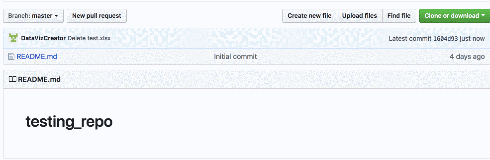
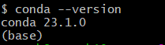

## 1.3: Overview of Machine Learning Tools

### Overview

Today's lesson will reveal the profound influence AI has on our everyday lives, and its wider societal implications. You'll engage in a series of activities, from brainstorming about your personal interactions with AI to investigating its transformative effects across diverse sectors. We'll also get our hands on practical AI tools like Anaconda, practice critical Terminal commands, and put those skills to work in GitHub, all while exploring the crucial role of robust coding documentation. Don't worry, we'll guide you step-by-step through essentials like installing Anaconda and setting up virtual environments.


### Class Objectives

By the end of today's class, the students will be able to:

* Articulate real world applications of AI and the benefits it provides.

* Add files to GitHub from the command line.

* Craft and evaluate good project documentation.

* Set up a virtual environment.

---


### Instructor Notes

In this module, we introduce Anaconda environments. This curriculum has been tested with Python 3.10, but updates to packages and variances in student machines can still cause conflicts to occur. If a student has an error that you believe to be related to Python 3.10, at your discretion you can instruct them to create a new environment using a different Python version. If you believe that an update has introduced a bug at a curriculum level, attempt to find a suitable workaround for the moment and submit a report using the Boot Camp Feedback Form.

* Students should have installed Anaconda before class. Next week, the students will be using Python from their Anaconda installation so be sure to take a moment to ensure that everyone has installed Anaconda today.

* Students may find themselves frustrated by some of the quirks that Git Bash and Terminal present. It’s important that you maintain a positive tone and are prepared to help the class fix whatever bugs they encounter.

* Try to identify confused students who may be reluctant to raise their hands and ask for assistance. Have the TAs circulate during the sections of the lesson that deal with console commands, especially as very few students will have ever worked with a computer this way. Also, regularly encourage the class to ask questions whenever they are confused, and reassure them that confusion is simply part of the learning process.

---


### Class Slides

The slides for this lesson can be viewed on Google Drive here: [Lesson 1.3 Slides](https://docs.google.com/presentation/d/1HjPjlz8QKbbwaB97m06x2WrtP0dV3vkSNUmRkTQyZD8/edit#slide=id.g21f2d3f9243_0_462).

To add the slides to the student-facing repository, download the slides as a PDF by navigating to File, selecting "Download as," and then choosing "PDF document." Then, add the PDF file to your class repository along with other necessary files. You can view instructions for this [here](https://docs.google.com/document/d/1XM90c4s9XjwZHjdUlwEMcv2iXcO_yRGx5p2iLZ3BGNI/edit).

> **Note** Editing access is not available for this document. If you wish to modify the slides, create a copy by navigating to File and selecting "Make a copy...".

---


### Time Tracker

| Start Time | Number | Activity                                           | Duration |
| ---------- | ------ | -------------------------------------------------- | -------- |
| 6:30 PM | 1 | Instructor Do: Introduction to Class | 0:05 |
| 6:35 PM | 2 | Everyone Do: AI Interactions | 0:15 |
| 6:50 PM | 3 | Instructor Review: AI Interactions | 0:05 |
| 6:55 PM | 4 | Instructor Do: The Impact of AI | 0:20 |
| 7:15 PM | 5 | Instructor Do: AI Foundations | 0:05 |
| 7:20 PM | 6 | Student Do: Terminal Refresher | 0:10 |
| 7:30 PM | 7 | Instructor Do: Review Terminal Refresher | 0:05 |
| 7:35 PM | 8 | Everyone Do: Adding Files from the Command Line | 0:25 |
| 8:00 PM | 9 | BREAK | 0:15     |
| 8:15 PM | 10 | Instructor Do: Documentation | 0:10 |
| 8:25 PM | 11 | Student Do: Explore README.md Files | 0:15 |
| 8:40 PM | 12 | Instructor Review: Explore README.md Files | 0:05 |
| 8:45 PM | 13 | Everyone Do: Install Anaconda | 0:10 |
| 8:55 PM | 14 | Everyone Do: Create a Virtual Environment | 0:15 |
| 9:10 PM | 15 | Instructor Do: Homework Q&A | 0:10 |
| 9:20 PM | 16 | Instructor Do: Wrap-up Class | 0:10 |
| 9:30 PM |         | END                                                |          |

---
### 1. Instructor Do: Introduction to Class (5 min)

Welcome students to the second day of class and the next lesson in Module 1.

Take some time to introduce the topics that will be covered in this lesson:

* Overview of AI and ML

* The Impact of ML

* Overview of ML Tools

Use the slideshow to review the objectives for today's class.

Cover the following points:

* Today, students will continue to learn about AI fundamentals by way of AI interactions, impacts, and underlying foundations. Later units and activities will delve into hands-on experience with advanced tools, techniques, and technical concepts.

* Students will continue their introduction to working with fundamental developer tools from the last few lessons. By the end of today, they will be familiar with README.md files, Anaconda, and virtual environments, as well as having advanced their skills in working within the Terminal.

Encourage students and get them excited for the lesson. Reiterate that, as before, today will be a crash course in both hard and soft skills: students will learn technical skills and contextual knowledge to aid them in their future careers in AI.

---


### 2. Everyone Do: AI Interactions (15 minutes)


Using the Zoom whiteboard feature, lead a brainstorming session with students to develop a list of all of the ways they interact with AI on a daily basis.

Let the students lead this portion of the discussion, asking probing questions but not offering additional examples yet&mdash;that will be covered in the next activity.

---

### 3. Instructor Do: Review AI Interactions (5 minutes)

Using the list that the students brainstormed in the previous activity, fill in any “gaps” the students missed.

Use the list below as a starting point, but try to draw on some of your own experience too:

* Search engines like Google and Bing

* Digital voice assistants like Siri and Alexa

* Chatbots

* Using Face ID to unlock a phone

* Image enhancement on your phone’s camera

* Social media algorithms to recommend people you know and posts you may be interested in

* Recommendation algorithms for streaming platforms like Netflix, music such as Spotify, or e-commerce sites like Amazon.com

* Auto correct and spelling/grammar checkers in text, email, and word processors

* Travel apps like Maps, Google Maps, and Waze

* Smart home devices like Ring and Nest

* Banking fraud alerts

* Autonomous vehicles, like Teslas

* Generative AI like ChatGPT, Midjourney, etc.

---

### 4. Instructor Do: The Impact of AI (20 minutes)

Continue with the slides and expand on the previous activity by exploring some of the many ways that students are interacting with AI without even knowing it.

Incorporate questions throughout the lesson to promote active listening and comprehension wherever you feel appropriate. For example, after explaining a given application of AI, ask: "Why do you think this application is important? Can you think of any potential drawbacks or challenges?"

Transition to talking about how AI is impacting the field of finance with the following examples:

* ML makes efficient decisions at lightning speed and has streamlined many operational processes.

* Chatbots can help increase responsiveness to customer demands, which plays a key role in attracting and retaining business.

Go into more detail by explaining that **financial advising** is a specific field in finance where ML can be used to recommend tailored portfolios and manage the whole process.

Benefits include:

* Reducing costs for end users

* Reducing costs for the business

Transition to talking about **forecasting market results** by explaining that machine learning models can also be used to forecast financial-market results ranging from loan evaluation to high-frequency algorithmic trading in the stock market.

Call out that algorithmic trading through statistical models is not a new concept:

* The Two Sigma Securities quantitative hedge fund, in business since the early 2000s, automatically trades more than 300 million shares a day.

* Within the last five years, however, algorithmic trading has come to account for 75% to 80% of all equity trades in the United States (Real Finance, 2019).

List some other ways AI is affecting finance that have not yet been covered:

* Identify money laundering and sanctions violations.

* Recognize satellites for the real-time awareness of trading opportunities in commodities.

* Predict customer churn in financial products.

* Predict the likelihood of start-up success for venture capital and private equity industries.

Feel free to add any specific examples from your own experience before moving on.

Transition to **additional business cases** by explaining that Beyond AI tools are already disrupting various other industries in a number of ways. Call out that ML can be applied to any situation that requires automation or prediction.

Explain that **chatbots** are computer programs that use AI and natural language processing (NLP) to evaluate customer queries and provide personalized feedback in a manner that resembles human interaction.

Summarize the benefits of using chatbots:

* Individuals requesting information can do so through audio or text input, or use a combination of the two.

* Chatbots have been shown to improve customer engagement and satisfaction, leading to increased retention and enhanced consumption.

* Chatbots are able to function 24/7, enabling them to reliably and efficiently meet customers’ requests at all hours.

* Chatbots are less costly to the company and free up human customer service representatives to handle more complex inquiries.

Sum up by explaining that chatbots increase productivity, boost efficiency, and reduce the need for outsourcing, which ultimately reduces costs.

Transition to the topic of **manufacturing** by explaining that AI algorithms have been embedded into the workflows of many manufacturing processes.

Utilizing a combination of various types of ML, machinery is equipped with sensors that feed data into the algorithm, providing constant, reliable, real-time updates.

Applications include:

* Automating the quality assurance process and reducing human error.

* Reducing the need for humans to complete tedious automated tasks, thereby reducing the physical stress brought on by many manufacturing jobs and increasing productivity.

* Optimizing inventory management.

* Studying consumer buying patterns and using them to predict demand, allowing companies to increase or decrease production of specific products as needed.

* Predicting maintenance failures before they happen.

* Reducing repair costs and improving safety.

* Reducing unnecessary emissions.

* Utilizing data sensors to provide real-time data, making the most efficient use of all resources, thus improving sustainability.

Explain that **programming** is another field that is being disrupted by AI. GitHub Copilot is an AI tool that suggests code to programmers, similar to the functioning of predictive text.

Describe GitHub Copilot at a high level:

* GitHub Copilot analyzes your code, then uses plain language text instructions in the form of comments to suggest code.

* Copilot allows programmers to manually change the code it suggested, and then it “learns” from this feedback to improve its suggestions in the future.

* Copilot can also auto-fill repetitive code blocks, saving programmers time and reducing the risk of frustrating errors.

GitHub Copilot became available to the public in 2022. Feel free to send the following link out and encourage students to try it out for themselves: [GitHub Copilot: Your AI Pair Programmer](https://github.com/features/copilot).

Mention that, as with many AI systems and developments, GitHub Copilot and similar tools prompt new ethical considerations. Be sure to mention that some experts have concerns given that the algorithm was trained on open-source code from GitHub. This leads to questions of intellectual property and copyright infringement, as programers’ code may have been used without consent or attribution.

If students have questions about ethics, answer them as best you can but remind them that there will be a full module on ethics later in the course.

Next, transition to how AI is impacting the **medical field**, including but not limited to the following applications:

* Facilitating documentation of medical data, gauging medical insights, and improving patient experiences.

* Analyzing x-rays using AI-enhanced visual imaging, increasing accuracy of MRIs and similar medical imaging.

* Optimizing clinical trials.

* Improving disease detection and diagnosis.

* Suggesting customized medical treatments for patients.

* Performing surgeries and determining with precision which medicines should be prescribed by evaluating a patient's medical history (in some cutting-edge applications only).

Mention some real-world data: AI applications in the US are believed to reduce annual healthcare costs by approximately $150 billion in 2026 (Bohr & Memarzadeh, 2020).

**AI medical assistants** free up clinicians from daily tasks that can easily be automated, thereby reducing the risk of human error, which is paramount in the medical field. These tools can assist doctors to make informed decisions and simplify medical concepts to patients.

Uses and benefits:

* Utilizing NLP to generate a transcript based on the consultation between patient and doctor, reducing the amount of time a doctor needs to write up their clinical notes, and also reducing the risk of human error.

* Reviewing medical charts and preventing potential medical crises by scanning patient’s medical records for potential drug interactions.

Call out that while algorithms can perform a set of repetitive tasks very well, it cannot do everything. One of the drawbacks of AI for medical applications is that the model cannot explain why it has suggested a diagnosis, which is particularly problematic when a human life is at stake. AI is not sentient. It cannot “think” and therefore it cannot truly understand the human condition or come up with creative solutions, both of which are critical in the medical field.

Transition to the topic of **pharmacology and drug research** by explaining that the historical process for researching, developing, and creating new drugs is incredibly time-consuming and labor-intensive. Recently, AI has been introduced into this process to support the development of new drugs so that development can happen quicker using fewer resources.

Specific applications:

* Synthesizing compounds for a new drugs to combat disease:

    * Identifying target molecules or proteins of particular diseases would otherwise require years of manual labor.

* Assisting in clinical trials:

    * Models can clean and collate data, create reports, assess the trial performance, and use all of the data from these phases to increase efficiency of future trials.

Transition to the topic of **genomics** by explaining that historically, sequencing an individual's genome produces approximately 100 gigabytes of raw data.

AI models can produce twice as much data by sequencing a genome using complex algorithms such as NLP and deep learning at a far reduced price point.

Deep learning is at the heart of these newly developing processes, specifically recurrent neural network (RNN) and convolutional neural network (CNN)-based models.

Explain a real life example. You may use the one provided below or one from your personal experience:

**Variant calling** is the process by which researchers determine the variations between a patient’s sample and the reference genome. It helps clinicians understand what genetic disease is causing the patient to be ill, and can help doctors prescribe the best treatment for a given patient. New AI algorithms are now being introduced to increase the speed and efficiency of variant calling, including [Google’s DeepVariant](https://google.github.io/deepvariant/) and [the Broad Institute’s GATK](https://gatk.broadinstitute.org/hc/en-us).

Before concluding this section on AI in medicine, call out that while there are many exciting opportunities to use AI and ML in the medical field, there are also ethical issues to be aware of, for example:

* There are racial biases already present in some fields of medicine; and

* When combined with the risk of algorithmic bias, there are concerns that these biases could be amplified, causing an increase in racial disparities.

Remind students that we’ll go into more detail on these ethical considerations later in the course.

Transition to the **AI in our daily lives** section, and directly to the AI interactions activity from earlier by reminding students of the topics they brought up themselves.

Connect the **generative AI** section to what students may already be familiar with, like text-generation tools such as ChatGPT.

Students may be used to the basic application of text generation to generate:

* Scripts for YouTube;

* News articles;

* Emails; and

* Cover letters.

The technology is evolving quickly and can also generate more complex output categories, such as:

* Code;

* Images;

* Music; and

* Genetic sequencing.

Remind students of their introduction to **transformers** in the neural networks section and explain that they are at the forefront of much of the research being done in the world of AI today. These models receive training from language models in the form of supervised learning. The transformer generates new material based on that training data.

Explain that **virtual assistants** are similar to chatbots in that they imitate human interactions.

While chatbots follow a rule-based algorithm, virtual assistants function through a more complex conversational AI that is able to answer questions, make recommendations, and perform various tasks.

**Self-driving cars**, also known as autonomous vehicles, use a combination of cameras, sensors, and AI to travel from one location to another without a human driver. The technology used to power these vehicles makes extensive use of reinforcement learning, along with the experience of safety specialists and virtual data to test this form of technology.

Another benefit to using AI technology in autonomous vehicles is that researchers can use reinforcement learning to train the algorithms, making them safer when interacting with the general public before they are even released into the world.

Feel free to bring up any additional examples from your own experience that haven’t been covered.

Ask for and answer any questions students may have before moving on to the next section.

---


### 5. Instructor Do: AI Foundations (5 minutes)


Today’s AI foundations section will cover installing Anaconda and creating virtual environments.

Virtual environments create isolated environments for Python projects.

They are helpful because they will ensure that you have the required dependencies installed before you begin a project, as different projects may have different dependencies.

You will use virtual environments throughout the course.

First, we’re going to refresh our memories on how to use Terminal.

---


### 6. Student Do: Terminal Refresher (10 minutes)

**Corresponding activity:** [01-Stu_Terminal_Refresher](Activities/01-Stu_Terminal_Refresher/)

Now students will do some work in the terminal. They’ll create three folders and add an .md file to each folder.

After answering any questions that students have about the activity, send out the instructions.

Open the slideshow, and use the next slides as an accompaniment to the activity.

---


### 7. Instructor Do: Review Terminal Refresher (5 minutes)


Open and send out the solution, then work through the solution code in the terminal while displaying the results on the computer.

Cover the following key points during your review of this activity:

* `mkdir` will make the directories.

* `cd` changes into directories.

* `touch` will create the file. It will be empty.

* To add lines of code to these files, simply edit them in a text editor.

* Then, we can run the code using `python quick_python.py`. Remind students using Macs to run the `which python` command, which will allow them to check that they are using Anaconda's Python (3.7+) instead of the default Mac version (2.7).

* `cd ..` will take you back **one** level to the `LearnPython` folder, where the process can be repeated.

* `cd ../..` will take you back **two** levels.

* Demonstrate and discuss the benefit of using the tab key for auto-completion while typing the path to a directory or running a file.

* Demonstrate and discuss the benefits of using the *up* and *down* arrow keys instead of repeatedly typing commands or using the tab key.

* Finally, guide students through the process of retrieving their command history by typing `history` on the command line.

* Incorporate some error handling tips or common issues that may arise when creating or modifying files using Terminal.

---


### 8. Everyone Do: Adding Files from the Command Line (25 minutes)

**Corresponding activity:** [02-Evr_Add_Files_From_Command_Line](Activities/02-Evr_Add_Files_From_Command_Line/)

Continue through the slideshow, using the next slides as an accompaniment to this activity.

Tell students that, so far, they have only added files using the GitHub website, which works well enough when just dealing with one or two files. What happens when we need to quickly add multiple files?

**The command line comes to the rescue!**

Have students follow along with creating a repo and adding files with Terminal/Git Bash:

1. First, create a new repo.

2. From the repo page, click the green box in the top-right labeled "Clone or download", select "Use SSH", and copy the link to the clipboard.

    

3. Open Terminal (or Git Bash for Windows users), and navigate to the home folder using `cd ~`.

4. Type `git clone <repository link>` in the terminal to clone the repo to the current directory. Once this code has run, everyone should find a folder with the same name as the repo.

    

5. Open the folder in VS Code and create two markdown files named `readme1.md` and `readme02.md`.

6. Then, open Terminal/Git Bash and navigate to the repo folder. Run the following lines, explaining each line as you go.

```bash
## Displays that status of files in the folder
git status

## Adds all the files into a staging area
git add .

## Check that the files were added correctly
git status

## Commits all the files to your repo and adds a message
git commit -m <add commit message here>

## Pushes the changes up to GitHub
git push origin main
```

7. Finally, navigate to the repo on [Github.com](https://github.com/) to confirm that the changes have been pushed up.

Make sure every student was able to successfully clone a repo, add files to the repo, commit the changes, and then push the changes to GitHub, all from the command line.

Discuss the "main" branch and how it was previously referred to as the "master" branch.


### 9. BREAK (15 minutes)


---


### 10. Instructor Do: Documentation (10 minutes)

This section deals with the importance of documenting projects with README.md files and comments.

Start this discussion by sharing a story from your professional experience that relates to project documentation.

For example, think of a time you had to work on a project that someone else had started. Maybe their documentation was exceptional, which was helpful, or maybe it was poor, and that set you back.

Next, ask the students to talk about their experiences with documentation. Have they used repos created by other people? If so, what was helpful about it, and what was challenging?

Discuss the importance of making applications that can be used by others. Be sure to mention the role this plays in getting a job. For example, employers may review your GitHub repository to get a sense of your skills, experience, and projects.

Transition into the importance of clear and thorough README.md documentation by explaining that in software development, the project or technical documentation often includes the following information to provide clarity for others looking at the project:

* The structures of an application

* The functions of an application

* The inputs and outputs of the functions

* The number of required parameters

* The data types of the parameters

* Required dependencies of the application

* Examples or screenshots of code snippets

Introduce the concept of a **README.md file** by explaining the following:

* A file that contains information about the other files in a directory

* In GitHub this shows up as `README.md`

* Can be created automatically when setting up a new GitHub repo

Explain that the `README.md` file uses **Markdown** syntax.

Frame the exploration around an existing `README.md` file. The slide image shows how the `README.md` file of the Python Poetry project displays on GitHub

The `README.md` file with Markdown syntax:

# Poetry: Dependency Management for Python

Poetry helps you declare, manage, and install dependencies of Python projects,
ensuring you have the right stack everywhere.


It supports Python 2.7 and 3.5+.

> **Note** Python 2.7 and 3.5 will no longer be supported in the next feature release (1.2). You should consider updating your Python version to a supported one.

[](https://github.com/python-poetry/poetry/actions?query=workflow%3ATests+branch%3Amaster+event%3Apush)

The [complete documentation](https://python-poetry.org/docs/) is available on the [official website](https://python-poetry.org).

## Installation

Poetry provides a custom installer that will install `poetry` isolated
from the rest of your system.

### osx / linux / bash for Windows install instructions

```bash
curl -sSL https://raw.githubusercontent.com/python-poetry/poetry/master/install-poetry.py | python -
```

### Windows powershell install instructions

```powershell
(Invoke-WebRequest -Uri https://raw.githubusercontent.com/python-poetry/poetry/master/install-poetry.py -UseBasicParsing).Content | python -
```

Point out that the Markdown syntax in the `README.md` source file gives us a nicely formatted display on GitHub.

Explain that the purpose of using Markdown is to create enhanced, formatted content that will display well online.

Cover some common Markdown features:

* Headings

* Font styling

* Horizontal rules

* Code and text snippets

* Block quotes

* Links

* Images

Demonstrate how this works by comparing the `README.md` file in the preceding section with its rendered content.

Cover the most commonly used examples Markdown syntax:

* One, two, or three number signs (`#`, `##`, or `###`) to specify a heading at Level 1, Level 2, or Level 3, respectively.

* One or two asterisks (`*` or `**`) to specify text that’s italic or bold, respectively.

* Three hyphens (`---`) to specify a horizontal rule.

* A right angle bracket (`>`) to specify a block quote.

* One or three backticks (`` ` `` or ` ``` `) to specify a snippet or a code block, respectively.

* Brackets and parentheses (`[<text>](<link>)`) to indicate a hyperlink. The brackets enclose the hyperlink text. The parentheses enclose the webpage URL.

* An exclamation point, brackets, and parentheses (``) to specify an image. The brackets enclose the alternative text, or alt text for the image. The parentheses enclose the file path of the image relative to that of the Markdown file.

Ask for and answer any questions students may have before moving on to the next section.

---


### 11. Student Do: Explore README.md Files (15 minutes)

**Files**

[Instructions](Activities/03-Stu_Explore_README_Files/README.md)

In this activity, students will work in groups to review `README.md` files for two GitHub repos, and then share suggestions for making them easier to read and understand.

Before sending them off, remind students that a GitHub repo usually details the purpose of the project, the reasons that it's useful, the installation instructions for new users, and examples for implementation.

**Instructions**

1. Go to the [trending page](https://github.com/trending?spoken_language_code=en) on GitHub and choose a repository to explore. Pick something that interests you and your team.

2. Review the `README.md` file and discuss the following with your group:

    * What do you like about this README.md?

    * What do you not like?

    * Is there anything you find confusing?

3. As you explore the README.md file, consider the following:

    * Does the text of the README.md make you excited to learn more about the project?

    * Is it clear who the intended audience is?

    * Does the README.md provide enough information?

    * Does it provide too much information?

4. After you have discussed the README.md file with your group, pick a second repository and then compare the two README.md files.

---


### 12. Instructor Review: Explore README.md Files (5 minutes)


Ask each group to share something helpful that they saw in a README.md file, as well as something that they felt could be improved.

---


### 13. Everyone Do: Install Anaconda (10 minutes)


Open the slideshow, and use the next slides for this activity.

Open up the console, and have students follow along.

Enable the Terminal commands by following the instructions for your operating system:

* **Windows:** In your terminal, run the command `conda init bash`. Then close your terminal and start a new one.

* **Mac:** If you're running an OS version earlier than 10.15 OR running version 10.15 with a `bash` Terminal environment, type `conda init bash`. If you're running versions 10.15 (Catalina) or later AND running the `zsh` environment, type `conda init zsh`. Then close your Terminal and start a new one.

* Enter `conda --version`, which will display the version of Anaconda installed, as in the following image:

  

Have TAs help any students who are experiencing difficulty. The most common problem will likely be that some students have not run `conda init bash` and/or restarted their Terminal.

* For students on Windows, the PATH needs to be added to Windows' environment variables. The easiest solution here is to uninstall/reinstall Anaconda and make sure to check the "Install to Path" box that comes up in a menu.

---


### 14. Everyone Do: Create a Virtual Environment (15 minutes)


Continue stepping through the slideshow as an accompaniment to this activity.

Next, proceed to an explanation of [managing virtual environments](https://conda.io/docs/user-guide/tasks/manage-environments.html):

* Virtual environments create an isolated environment for Python projects.

* Explain how different projects can have different dependencies.

* Explain how different projects might also use different types and versions of libraries.

* This virtual environment will make sure that everyone has all the right dependencies for future class activities.

Sharing the following analogy may be useful if some students are still confused:

* Imagine you had exactly one flat surface in your entire home. You used it for cooking, homework, sleeping, hobbies, and anything else that required a flat surface.

* That surface would become incredibly cluttered, and tools for one task may accidentally be used for another task.

* Creating a virtual environment is similar to adding another flat surface in your home&mdash;this way, tasks and tools can be installed, organized, and modified specifically for one use without affecting tools used for other things.

Walk the class through creating the `dev` virtual environment that will run Python 3.10. This will help solve issues where students have multiple versions of Python installed.

* First, update the conda base environment:

  ```
  conda deactivate
  conda update conda
  conda update anaconda
  conda update -n base -c defaults conda
  ```

    * Have students type `y` whenever prompted to proceed.

* Next, create a new environment called `dev` using Python 3.10 with the default packages from Anaconda:

  ```
  conda create -n dev python=3.10 anaconda -y
  ```

* Have students activate their environment:

  ```
  conda activate dev
  ```

* Finally, explain that you can exit the environment by entering `conda deactivate`.

Tell students that they will need to activate their environment each time they open a new Terminal. Windows users should always use `git-bash` for their Terminal.

---


### 15. Instructor Do: Homework Q&A (10 minutes)

Now that the students have a better understanding of GitHub, ask if they have any questions about the process of uploading their Challenge assignment to GitHub.

---

### 16. Instructor Do: Wrap-up Class (10 minutes)

Use the last few minutes of class to allow the students to digest and decompress from this lesson.

First, congratulate students for completing their first full week of class!

Recap today's objectives. Students are now able to:

* Articulate real-world applications of AI and the benefits it provides;

* Add files to GitHub from the command line;

* Craft and evaluate good project documentation; and

* Set up a virtual environment.

Ask if students have any remaining questions before ending the class. If needed, TAs will be hosting office hours after class.

### End Class

---

### References

Bohr, A. & Memarzadeh, K. 2020. *The rise of artificial intelligence in healthcare applications.* Artificial Intelligence in Healthcare. 25-60.

Merritt. R. 2022. *What is a transformer model?* NVIDIA Blog. [2023, April 5].

Real Finance. 2019. *Algo trading dominates 80% of stock market.* Seeking Alpha. [2023, April 21].

Sanghavi, A. 2022. *30 self-driving statistics to drive you crazy.* G2. [2023, April 21].

Son, H. 2017. *JP Morgan software does in seconds what what took lawyers 360,000 hours.* The Independent. [2023, April 21].

---

© 2023 edX Boot Camps LLC. Confidential and Proprietary. All Rights Reserved.

