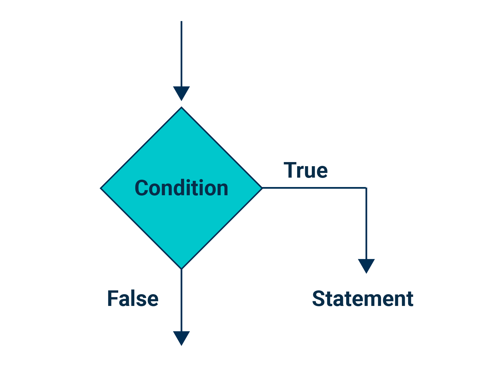

## 2.2: Programming Decisions

### Overview

In today’s class, students will further explore core programming concepts, with data structures like lists and tuples. They'll gain control over their code with conditional statements and loops, enhancing their problem-solving abilities. Advanced topics like nested decisions and loop breaking will further refine their coding skills. Engaging in hands-on activities throughout the class will bridge the gap between theory and practice, fostering confident and proficient Python programmers.

### Class Objectives

By the end of today's class, the students will be able to:

* Construct lists and tuples, manipulate list elements using indexing and slicing, and apply list functions such as `len()`, `max()`, `min()`, `sum()`, `append()`, `pop()`, and `remove()` effectively.

* Formulate if-else statements, apply comparison operators, and use the `isdigit()` function to validate if a string is a number, demonstrating a robust understanding of basic conditional structures in Python.

* Integrate `elif` statements for more complex decision-making, utilize logical, membership, and identity operators effectively, and employ the `type()` function for input validation.

* Implement `for` loops and `while` loops, utilize the `range()` function and the `+=` operator, and apply the underscore in `for` loops, showcasing a strong understanding of Python's loop structures.

* Develop nested conditionals and nested loops and use the break statement to interrupt loop execution.

---

### Instructor Notes

In this module, we delve deeper into Python programming by introducing students to the fundamental concepts of data structures, conditionals, and loops. We begin by discussing the concept of data structures, with a focus on lists and tuples, including various list operations. You'll need to ensure that students have a clear understanding of these foundational data structures and their operations.

Following that, we introduce the concept of conditional statements in Python. Start with If-else statements, comparison operators, and Boolean expressions, and then progressively move to more complex concepts like `elif` statements, logical, membership, and identity operators. The session also covers input validation using the `isdigit()` method and the `type()` function, and it's crucial to stress the importance of validating user inputs in real-world programming.

The module then moves on to Python loops. We'll cover both `for` and `while` loops, using the `range()` function, the `+=` operator, and the role of underscores in `for` loops. Further in the class, we venture into advanced topics like nested conditionals and loops, and the use of the break statement.

In this module, we use Anaconda environments. This curriculum has been tested with Python 3.10, but updates to packages and variances in student machines can still cause conflicts to occur. If a student has an error that you believe to be related to Python 3.10, at your discretion you can instruct them to create a new environment using a different Python version. If you believe that an update has introduced a bug at a curriculum level, attempt to find a suitable workaround for the moment and submit a report using the Boot Camp Feedback Form.

* Students should have installed Anaconda in the previous module. Today, the students will be using Python from their Anaconda installation. Take a moment to ensure that everyone has installed Anaconda.

* Students may find themselves frustrated by some of the quirks of Python. It’s important that you maintain a positive tone and are prepared to help the class fix whatever bugs they encounter.

* Try to identify confused students who may be reluctant to raise their hands and ask for assistance. Also, regularly encourage the class to ask questions whenever they are confused, and reassure them that confusion is simply part of the learning process.

You may introduce lists and tuples to students from the command line interpreter, but once you introduce conditionals and loops, it is preferable to run the Python solution files from the command line using `python script_name.py`.

As debugging and troubleshooting are critical skills for students to learn, take advantage of the errors that come up naturally during class in either your code or your students’ code whenever possible. Encourage students to analyze the problem and suggest solutions to each other. Time constraints can make it difficult to troubleshoot every error that arises, especially with larger class sizes. Encourage students to screenshot their code and the error they are getting as soon as something goes wrong. Have them post the screenshots in the “live” channel in Slack, and have TAs and students who are already finished with the activity attempt to troubleshoot the problem. Have your TAs call out any errors that may deserve dedicated class time for troubleshooting.

Even with these best practices in place, some students will have errors that can’t be solved during class time. Make sure TAs are encouraging students to attend office hours for any debugging that they still need help with at the end of class.

---

### Class Slides

The slides for this lesson can be viewed on Google Drive here: [Lesson 2.2 Slides](https://docs.google.com/presentation/d/1av6gxZknglO6IPIOWEjX1twCHJkFg3Wz0dR1Mc57X7A/edit?usp=sharing).

To add the slides to the student-facing repository, download the slides as a PDF by navigating to File, selecting "Download as," and then choosing "PDF document." Then, add the PDF file to your class repository along with other necessary files. You can view instructions for this [here](https://docs.google.com/document/d/1XM90c4s9XjwZHjdUlwEMcv2iXcO_yRGx5p2iLZ3BGNI/edit).

**Note:** Editing access is not available for this document. If you wish to modify the slides, create a copy by navigating to File and selecting "Make a copy...".

---

### Time Tracker

| Start Time | Number | Activity                                           | Duration |
| ---------- | ------ | -------------------------------------------------- | -------- |
| 6:30 PM    | 1      | Instructor Do: Introduction to Class               | 0:05     |
| 6:35 PM    | 2      | Instructor Do: Lists and Tuples                    | 0:10     |
| 6:45 PM    | 3      | Students Do: Create a Menu                         | 0:15     |
| 7:00 PM    | 4      | Review: Create a Menu                              | 0:05     |
| 7:05 PM    | 5      | Instructor Do: Conditionals                        | 0:10     |
| 7:15 PM    | 6      | Students Do: Conditional Conundrum                 | 0:10     |
| 7:25 PM    | 7      | Review: Conditional Conundrum                      | 0:05     |
| 7:30 PM    | 8      | Instructor Do: Complex Conditionals                | 0:15     |
| 7:45 PM    | 9      | Students Do: Smooth Operator                       | 0:15     |
| 8:00 PM    | 10     | Review: Smooth Operator                            | 0:05     |
| 8:05 PM    | 11     | BREAK                                              | 0:15     |
| 8:20 PM    | 12     | Instructor Do: Loops                               | 0:10     |
| 8:30 PM    | 13     | Students Do: Travel Loops                          | 0:15     |
| 8:45 PM    | 14     | Review: Travel Loops                               | 0:05     |
| 8:50 PM    | 15     | Instructor Do: Nested Decisions                    | 0:10     |
| 9:00 PM    | 16     | Students Do: Loop de Loop                          | 0:20     |
| 9:20 PM    | 17     | Review: Loop de Loop                               | 0:05     |
| 9:25 PM    | 18     | Instructor Do: Class Wrap Up                       | 0:05     |
| 9:30 PM    |        | END                                                |          |

---

### 1. Instructor Do: Introduction to Class (5 min)

Open the slideshow as you cover the following talking points:

Recap the content covered from the previous day:

* Use pseudocode to map out a problem
* Understand how to use code comments
* Understand Python syntax
* Create variables
* Perform calculations with operators
* Print text to the screen with f-strings
* Understand basic data types and how to convert them with type casting

Provide an overview of the content that will be covered today, the objectives listed here expand somewhat on those listed in the slides.

By the end of today's class, the students will be able to:

* Construct lists and tuples, manipulate list elements using indexing and slicing, and apply list functions such as `len()`, `max()`, `min()`, `sum()`, `append()`, `pop()`, and `remove()` effectively.
* Formulate if-else statements, apply comparison operators, and use the `isdigit()` function to validate if a string is a number, demonstrating a robust understanding of basic conditional structures in Python.
* Integrate `elif` statements for more complex decision-making, utilize logical, membership, and identity operators effectively, and employ the `type()` function for input validation.
* Implement `for` loops and `while` loops, utilize the `range()` function and the `+=` operator, and apply the underscore in `for` loops, showcasing a strong understanding of Python's loop structures.
* Develop nested conditionals and nested loops and use the break statement to interrupt loop execution.

---

### 2. Instructor Do: Lists and Tuples (10 min)

**Corresponding Activity:** [01-Ins_Lists_Tuples](Activities/01-Ins_Lists_Tuples/)

Continue using the slideshow to accompany this demonstration.

#### Data structures

Introduce students to the concept of data structures. For this course, we’re working with the understanding that data structures are anything that holds information that isn’t a variable, and in fact often store multiple variables which may or may not be different data types.

Lists and tuples are both data structures that will be explored in this section.

Explain the importance and usefulness of data structures, such as:

* They can store more information than variables.

* They can help us organize related information.

* They can help us perform actions on the data contained in them.

#### Understand Lists

In Python, we can store this sequence of data in a container called a list. A list is a collection of ordered and changeable items.

Open up the solution file and command line interpreter, then demonstrate how to make and print a list in Python using the following code:

```python
# Create a variable and set it as a list
info_list = ["Samar", 25, "Kyra", 20]
print(info_list)
```

Point out that now all the data is stored and output together, but sometimes you want to retrieve only a specific item.

#### Understand List Indexing

Explain that the position of a particular item in the list is referred to as the index.

It’s important to grasp and remember that list index positions start at 0, so the item at index position 1 is actually the second item in the list. In the `info_list` list, the first item, "Samar", is at index 0.

Explain that it is also possible to use list indexing from the end of the list by incorporating a minus sign at the beginning of the index. For example, the last item in a list can be referenced with the index -1.

Demonstrate this to the students with the following code snippet:

```python
# Return the value of a list at a given index
print(info_list[0])
print(info_list[-1])
```

This code returns `Samar` and `20` respectively.

Explain that sometimes we may know the value of a list item, but we need to be able to reference its index. We can find out a list item’s index with the `index()` method, passing the list item’s value into the method. Demonstrate this with the following code:

```python
# Return the index of the first object with a matching value
print(info_list.index("Kyra"))
```

This code returns `2`.

#### Understand List Slicing

Introduce the concept of list slicing to students as a step beyond indexing, useful for when you want to do something with a part, but not necessarily all, of a list.

This can be achieved by using a colon, `:`, in the parameters of a list which allows you to:

* Select items from the start index to the stop index.

    `my_list[start:stop]`

* Select items from the start index to the end of the list.

    `my_list[start:]`

* Select items up to the stop index.

    `my_list[:stop]`

* Select all items in the list.

    `my_list[:]`

Demonstrate this again by using the movie stars example in the code snippet below:

```python
# Return a list slice [index_start:index_end]
print(info_list[2:4])
print(info_list[1:])
print(info_list[:2])
```

Each line of this code produces the following output:

```text
['Kyra', 20]
[25, 'Kyra', 20]
['Samar', 25]
```

Use this as an opportunity to point out that the start index will be included and the stop index excluded when pulling items from a list. Slicing begins at the first index and goes *up to* the second.

#### List Functions

Take students through the various list functions available to them.

List functions help us make changes to lists and understand the data contained in them. Specifically:

* Make changes: `append()`, `pop()`, `remove()`
* Understand the data/list: `len()`, `max()`, `min()`, `sum()`

Cover the list-editing methods first:

* `append()`: Adds elements to the end of a list. 
* `pop()`: Removes a value by index.
* `remove()`: Deletes a given value from a list.

Demonstrate these functions with the `info_list` list with the following code:

```python
# Methods for modifying a list

# Add an element onto the end of a list
info_list.append("Kamau")
print(info_list)

# Change a specified element within a list at the given index
info_list[3] = 85
print(info_list)

# Remove a specified object from a list
info_list.remove("Kamau")
print(info_list)

# Remove the object at the index specified
info_list.pop(0)
info_list.pop(0)
print(info_list)
```

Explain and demonstrate the methods that produce useful information about the contents, and point out other situations where they can and cannot be used:

* `len()`: Returns the length of the list and can also be used on tuples, strings, and dictionaries. (Students will learn about dictionaries in the next class.)

* `max()`: Returns the maximum value in the list. If used on a list of strings it will return the alphabetical maximum.

* `min()`: Works like `max()` but for the minimum value. Similarly to `max()`, if used on a list of strings will return the alphabetical minimum.

* `sum()`: Adds all the numbers in the list together. This is the only function that can only be used on a list of numbers.

Note that the `max()` and `min()` functions will return an error if there are mixed data types in the list.

Demonstrate these functions with the following code:

```python
scores = [92, 87, 68, 75, 96]

# Return the max (or highest value) item in a list
print(f"Max score: {max(scores)}")

# Return the min (or lowest) item in a list
print(f"Min score: {min(scores)}")

# Return the sum of the items in a list
print(f"Sum score: {sum(scores)}")

# Return the length of the list
print(f"Length of score list: {len(scores)}")

# Use sum and len to calculate average
average_score = sum(scores) / len(scores)
print(f"Average score: {average_score}")
```

Point out that there is no default function to calculate the mean or average value in a list of numbers, but we can calculate this value by using a calculation that combines the `sum()` and `len()` functions.

#### Understand Tuples

Python also has a data type called **tuples**, which are functionally similar to lists in what they can store, but they are immutable, meaning that unlike lists which can be modified after their creation, tuples can never be modified after their declaration.

Tuples have the advantage of being somewhat more efficient to navigate through than lists, while also protecting the data stored within from being changed.

Demonstrate some examples of tuples, and how to use the list functions that also work on tuples, from the solution file. This time you will perform the functions on a tuple of strings when they work on strings.

```python
# Create a tuple, a sequence of immutable Python objects that cannot be changed
info_tuple = ("Python", 100, 4.65, False)
print(info_tuple)

# Information functions also work on tuples, provided they contain valid data 
# types
names_tuple = ("Melanie", "Jacinta", "Yindi", "Li")

print(len(names_tuple))
print(max(names_tuple))
print(min(names_tuple))

guests_tuple = (3, 5, 2, 4, 3)
print(sum(guests_tuple))
```

Explain that understanding tuples is particularly important as they are integral to machine learning. For example, when we’re splitting data into different sets with a machine learning function, we will be unpacking a tuple to use those sets of data separately. Unpacking tuples will be explored further in the final class this week when we cover dictionaries, another kind of data structure.

Send out the solution for students to use as a reference, then ask the students if they have any questions before introducing the next activity where they will be practicing working with lists by themselves.

---

### 3. Students Do: Create a Menu (15 min)

**Corresponding Activity:** [02-Stu_Create_a_Menu](Activities/02-Stu_Create_a_Menu/)

Continue through the slideshow, using the next slides as an accompaniment to this activity.

This activity will allow students to practice using tuples, lists, list functions, and methods to create and modify a restaurant menu.

---

### 4. Review: Create a Menu (5 min)

**Corresponding Activity:** [02-Stu_Create_a_Menu](Activities/02-Stu_Create_a_Menu/)

Open the solution, share the file with the students, and go over it with the class, answering whatever questions students may have.

Cover the following key points during the discussion:

* We can append directly to a list with the user input function `input()` passed into the `append()` method:

    ```python
    # Ask a user to input a new item and append it to the relevant list.
   desserts.append(input("What dessert would you like to add? "))
    ```

* On a similar note, we can also convert this input to a float inside the `append()` method:

    ```python
    # Ask a user to input the price of the new item, referenced using list indexing
    # and append it to the relevant list.
    dessert_prices.append(float(input(f"How much does {desserts[-1]} cost? ")))
    ```

    * Some students may have saved these inputs to variables first. This is also acceptable&mdash;it just requires more lines of code.

* When we are appending two different, related lists, and want to reference the last item in the first list when asking about what should be included in the second one, we can use the negative list indexing, as we did for `desserts[-1]` in our input question `input(f"How much does {desserts[-1]} cost? ")`.

* We can incorporate f-strings anywhere we are using strings, not just in string creation and in the `print()` function. Here, we utilize them inside the `input()` function.

* When we want to remove an item from one list, and remove its associated item in a second list, we need to first get the item’s index, so we can reference it to remove from the second list:

    ```python
    # Ask the user which item to remove from the menu.
    remove_item = input("Which item do you want to remove? ")

    # Find the index of the item and save it as a variable.
    index = desserts.index(remove_item)

    # Remove the item from the menu list using remove().
    desserts.remove(remove_item)

    # Remove the item from the prices list using pop().
    dessert_prices.pop(index)
    ```

* Remind the students that we use the `pop()` method to remove an item by index, and the `remove()` method to remove an item by the value.

* We can check that we added and removed the correct number of items for each list by comparing the length of each list with the `len()` function.

    ```python
    # Confirm that the menu and prices lists are the same length.
    print(
        f"The menu length is {len(desserts)} and the prices length is "
        + str(len(dessert_prices))
    )
    ```

Ask the students if they have any questions and send out the solution before moving on to the next activity.

---

### 5. Instructor Do: Conditionals (10 min)

**Corresponding Activity:** [03-Ins_Conditionals](Activities/03-Ins_Conditionals/)

Continue using the slideshow to accompany this demonstration.

Introduce this section by pointing out that understanding conditionals is crucial in programming. Conditionals allow you to direct what actions a program should take under particular circumstances.

Link this back to the pseudocoding demonstration in the last class, where we explored conditionals and debugging for edge case situations. e.g. when there was a crack in the dish - this is similar to input validation, which is a common reason for conditionals. We’ll go over input validation soon.

#### Decision Statements

Introduce students to the `if` statement

##### `if`

In a simple decision structure like an `if` statement, if a condition is met (i.e., is true), then an action is performed. If the condition is not met (i.e., is false), then the action is not performed. This can be illustrated with the following flowchart:
  


Share the following the general rules for using `if` statements in Python:

* `if` statements begin with the word "if," followed by a condition. The condition can be an expression like `if len(list) > 2:`, which will be evaluated as either true or false. At the end of the condition is a colon.

* The next line contains a block of statements. All statements in a block must be consistently indented. If you do not indent, your code will not be executed.

* If the statement is not met (i.e., is false), then the statements in the block are skipped.

Take some time to explain the indentation requirement with Python syntax:

* When we write a decision declaration followed by a colon (e.g., `if condition_is_true:`), the subsequent lines&mdash;anything the script should do when the condition is true&mdash;should be indented by four spaces.

* Tabs can be used in place of spaces, but they cannot be intermixed in a script, and [spaces are the PEP8 Standard](https://peps.python.org/pep-0008/#indentation).

**Note**: In VS Code, hitting the Tab key will automatically add four spaces rather than a tab character.

Once the code is back at the same level, the subsequent code will run whether or not the decision condition is true.

**Important:** This indentation is very strict and a Python script will not run if even one line that should be indented does not match the correct indentation for its level. Consistency is important here. This is a common bug that students may encounter, so be sure that students are aware of this.

##### `if-else`

Explain that the `if-else` statement is used when we need an outcome for both true and false conditions. The `if-else` statement is also referred to as a *dual-alternative decision statement*.

An `if-else` statement will execute one block of statements, or path, if a condition is true, or another block of statements if the condition is false. This can be illustrated with the following flowchart.


Explain how an `if-else` statement works.

* The `if-else` statement begins with the word "if," followed by a condition.
* The condition is tested.
* If the condition is true, the block of indented statements following the `if` statement is executed, and the program moves out of the `if-else` statement.
* If the condition is false, the program skips to the `else` statement, the block of indented statements following the else statement is executed, and the program moves out of the `if-else` statement.

#### Comparison Operators

Circle back to the comparison operators featured in the above examples and explain that comparison operators are one type of operator that can be used to write conditional statements. Specifically, they are used to compare values.

The following table highlights the different comparisons and their meanings.

| Operator     | Meaning                         |
|--------------|---------------------------------|
|     >        | greater than                    |
|     >=       | greater than or equal to        |
|     <        | less than                       |
|     <=       | less than or equal to           |
|     ==       | equal to                        |
|     !=       | not equal to                    |

#### Boolean expressions and input validation

Explain that conditional statements using comparison operators are Boolean expressions, i.e., they evaluate to either `True` or `False`. Boolean expressions do not always need to use special operators like comparison operators in conditional statements. They may be as simple as using a Boolean variable in an `if` statement, which will evaluate to `True` or `False`, or more complex expressions that include using functions to evaluate if the result is `True` or `False`.
These types of Boolean expressions are commonly used with input validation.

Explain that input validation is about checking if a user’s input is a valid input for the purpose it will be used for. For example, if we need the input to be a number because we want to perform a calculation on it, we should check that the input is a number before converting it to the correct data type. 

Use `.isdigit()` to introduce the concept of input validation:

```python
if string.isdigit():
    number = int(string)
```

The `if` statement checks whether the Boolean expression, or the condition (in this example `string.isdigit()`) is true or false. If true, the program will perform the indented action below the `if` statement. If it is false, it will skip over that indent and continue on below.

Open up the solution file associated with this activity in VS Code to demonstrate code examples of the examples covered, then run the script from the command line.

The solution code includes the option to uncomment the `congratulations` variable where it's assigned the value `False`, So if time permits, run the script twice so that you can demonstrate both Boolean expressions evaluating as `True` and `False`.

Ask the students if they have any questions before sending out the solution file and moving on to the next activity where they will practice working with conditionals on their own.

---

### 6. Students Do: Conditional Conundrum (10 min)

**Corresponding Activity:** [04-Stu_Conditional_Conundrum](Activities/04-Stu_Conditional_Conundrum/)

Continue through the slideshow, using the next slides as an accompaniment to this activity.

This activity will give students the opportunity to review prewritten conditionals and predict the lines that will be printed to the console.

---

### 7. Review: Conditional Conundrum (5 min)

**Corresponding Activity:** [04-Stu_Conditional_Conundrum](Activities/04-Stu_Conditional_Conundrum/)

Open the solution, share the file with the students, and go over it with the class, answering whatever questions students may have.

You may like to copy each conditional statement into the Python command line interpreter and ask the students what they think will print before pressing Enter and running the code. Note that the result of each conditional is included in the comment above each conditional statement.

Cover the following key points during the discussion:

* The most challenging condition in this activity is the final one, where `altitude = "66,000"`. Since it looks like a number, some students might think it would evaluate to `True` with `isdigit()`. In reality, the comma in the string leads to the expression evaluating as `False`. If you have time, you may want to demonstrate the error that occurs when converting the string to a float:

    ```python
    float("66,000")
    ```

    ```text
    Traceback (most recent call last):
      File "<stdin>", line 1, in <module>
    ValueError: could not convert string to float: '66,000'
    ```

* Explain that `isdigit()` will only return true if *every* character in the string is a number. This also means that only numbers that can be converted to integers will be evaluated as true using `isdigit()` alone. Tell the students that they will learn how to use `isdigit()` if they want to check if a string can be converted to a float in another activity later today.

Ask the students if they have any questions and send out the solution before moving on to the next activity.

---

### 8. Instructor Do: Complex Conditionals (15 min)

**Corresponding Activity:** [05-Ins_Complex_Conditionals](Activities/05-Ins_Complex_Conditionals/)

Continue using the slideshow to accompany this demonstration, as well as opening up the solution file in VS code to demonstrate each code example. You may demonstrate the code running either from the Python command line interpreter within VS Code's Terminal, or running the solution script from the command line at the end of the demonstration.

Introduce this section by explaining that coding projects and their solutions often involve complex decision-making that requires more complex and versatile conditional statements than we have explored so far.

Start with the introduction of another type of operator that can be used in conditional statements: logical operators.

#### Logical Operators

Explain what to do with conditional statements where multiple conditions need to be checked and met. This is where logical operators come in handy. You can take advantage of logical operators such as `and`, `or`, and `not`:

* `and`: Evaluates two Boolean expressions into one compound expression. The compound expression is true if **both** Boolean expressions are true. If one of the expressions is false, then the compound expression is false.

    ```python
    # Check for two conditions to be met using "and"
    if x == 1 and y == 10:
        print("Both values returned true")
    ```

* `or`: Evaluates two Boolean expressions into one compound expression. The compound expression is true if **either** Boolean expression is true. If one of the expressions is false, then the compound expression is true. If both expressions are false, then the compound expression is false.

    ```python
    # Check if either of two conditions is met using "or"
    if x < 45 or y < 5:
        print("One or more of the statements were true")
    ```

* `not`: Evaluates a Boolean expression. The expression is true if the conditional is **false**.

    ```python
    # Check if a condition is not true
    if not (x > y):
        print("x is not greater than y")
    ```

#### `elif`

Explain that `if-elif-else` statements allow us to check for more than one condition, with `elif` standing for else-if:

* The first `if` statement tests the condition.
* The condition in each `elif` statement that follows is only checked if none of the preceding conditions are met.
* This syntax continues until the last else statement.
* In an `if-elif-else` statement, the `if`, `elif`, and `else` statements are all aligned, and the conditionally executed blocks are indented.

Point out that `elif` statements help with decision trees with multiple possible outcomes.

Demonstrate an example of the `if-elif-else` statement by putting into practice the pseudocode we wrote in the first class, incorporating the edge-case situation of determining where to put a cracked plate.

```python
# Check multiple conditions
plate = "fancy"
if plate == "cracked":
    print("Throw the dish away")
elif plate == "fancy":
    print("Put the plate on the top shelf")
else:
    print("Put the plate on the bottom shelf")
```

#### Membership Operators

Next, introduce **membership operators** for testing whether an object, like a string, integer, or other data type is present in an expression, list, tuple, or dictionary. They can also work for testing if a substring is in a string. Explain the following operators:

* `in`: Returns True if a sequence with the specified value is present in the object.

    ```python
    # Check if a variable is in a list
    name = "Amidah"
    group_one = ["Jorge", "Joon", "Susan"]
    group_two = ["Gerald", "Paola", "Ryder"]
    group_three = ["Farah", "Amidah", "Koen"]

    if name in group_one:
        print(name + " is in the first group")
    elif name in group_two:
        print(name + " is in group two")
    elif name in group_three:
        print(name + " is in group three")
    else:
        print(name + " does not have a group")
    ```

* `not in`: Returns True if a sequence with the specified value is not present in the object.

    ```python
    # Check if a variable is not in a list
    countries = ["Fiji", "Australia", "New Zealand", "Papua New Guinea", "Palau"
                 "Solomon Islands", "Micronesia", "Vanuatu", "Samoa", "Kiribati",
                 "Tonga", "Marshall Islands", "Tuvalu", "Nauru"]
    country = "Kenya"

    if country not in countries:
        print (country + " is not in Oceania")
    ```

**Note**: We will be using the ‘in’ identity operator in this week’s challenge in relation to a dictionary’s keys, but for today we will be using it with user-specified lists.

#### Identity Operators

Next, introduce **identity operators**. Students now know how to combine Boolean expressions together in a check and how to determine what is or isn’t in a list. But what if you need to do input validation and have different outcomes related to the type of input?

This is where `type()` comes in handy. Explain how it works with reference to the code snippet below:

```python
# Conditionals with identity operators: "is" and "is not"

# Check if a variable is a list
if type(countries) is list:
    print("countries is a list")

# Check if a variable is not a list
if country is not list:
    print("country is not a list")

# Check if a variable is a float or integer
if type(x) is float:
    print("x is a float")
elif type(x) is int:
    print("x is an integer")
else:
    print("x is not a number")
```

The `is`, as used in the `type()` example, is an identity operator. That and `is not` are described below:

* `is`: Returns True if the two objects are the same object.

* `is not`: Returns True if the two objects are not the same object.

**Note**: We will be using the `is` identity operator in this week’s challenge in relation to checking if a dictionary’s value is a dictionary. Students will learn how to check for the dictionary type in the next class.

If there is time, use the final section of code in the solution file to demonstrate incorporating multiple aspects of today's lessons into an if-elif-else statement. The final `elif` incorporates using `or` and multiple `and` operators, and demonstrates how and when to use parentheses in such situations.

Ask the students if they have any questions before moving on to the next practice activity.

---

### 9. Students Do: Smooth Operator (15 min)

**Corresponding Activity:** [06-Stu_Smooth_Operator](Activities/06-Stu_Smooth_Operator/)

Continue through the slideshow, using the next slides as an accompaniment to this activity.

This activity will allow students to practice writing complex conditional statements with comparison, logical, membership, and identity operators using a real-world scenario of making travel plans.

---

### 10. Review: Smooth Operator (5 min)

**Corresponding Activity:** [06-Stu_Smooth_Operator](Activities/06-Stu_Smooth_Operator/)

Open the solution, share the file with the students, and go over it with the class, answering whatever questions students may have.

Cover the following key points during the discussion:

* Reinforce checking if a variable is a number before casting it with type casting.

* Multiple types of operators can be used together to write a Boolean expression in a conditional statement, such as checking if two variables are both integers before performing a calculation, as in the following example, which uses both identity and logical operators:

    ```python
    # Check if budget and days are integers, and if so, calculate the daily budget
    if type(days) is int and type(budget) is int:
        daily_budget = budget / days
        print(f"The daily budget is ${daily_budget}")
    # Else print an error
    else:
        print("There was an error. Unable to calculate daily budget.")
    ```

* We often have to check conditions and look up information before we can decide what actions to perform. In the travel scenario, we have to check if the destination the user wants to visit is in the list. If it is, we can look up its associated daily cost, which then allows us to perform calculations and determine if it's within our budget for the number of days we want to visit.

* Break down the final complex conditional statement:

    ```python
    if city_daily_cost > 0 and city_daily_cost <= daily_budget:
    elif city_daily_cost > 0 and city_daily_cost > daily_budget:
    else:
    ```

    * In the previous conditional statement, we set `city_daily_cost` to `0` when the condition was not meant. This allows us to check the result here to ensure that there wasn't an error. So, we check to make sure the value is greater than 0. Then we want to check if the daily cost is within our budget or not, and perform different actions depending on the scenario. Can the user afford the trip?

Ask the students if they have any questions and send out the solution before taking them into the break. Let the students know that after the break, you will be covering loops and nested decision-making.

---

### 11. BREAK (15 min)

---

### 12. Instructor Do: Loops (10 min)

**Corresponding Activity:** [07-Ins_Loops](Activities/07-Ins_Loops/)

Continue using the slideshow and solution code to accompany this demonstration.

Emphasize the importance for programming by pointing out that `for` loops are often used to perform the same action on multiple elements in a data structure to process information. `for` loops can also be used to perform a specific action or set of actions a specific number of times (using the `range()` function).

Open up the solution file within a text editor, and explain the following points:

* The variable `x` is created within the loop statement and could theoretically take on any name as long as it is unique.

* When looping through a range of numbers, Python will halt the loop one number before the final number. For example, when looping from 0 to 5, the code will run five times, but `x` will only ever be printed as 0 through 4.

* When provided with a single number, `range()` will always start the loop at 0. However, when provided with two numbers, the code will loop from the first number until it reaches one fewer than the second number.

* The following code captures examples of range loops:

    ```python
    # Loop through a range of numbers (0 through 4)
    for x in range(5):
        print(x)

    # Loop through a range of numbers (2 through 6 - yes 6! Up to, but not
    # including, 7)
    for x in range(2, 7):
        print(x)
    ```

* The underscore `_` is also known as a dummy variable. It is useful as a placeholder in loops where you only need a simple counter that you will not be calling or using again at a later stage.

  **Note**: If you are counting something specific or in a way that will need to be stored for later reference, it is always better to create a unique variable to store that value.

* The `+=` operator performs addition with the two items on either side of the operator and assigns the result to the left. So that instead of typing out  `x = x + y` you can simply use `x += y`. This is useful for the many situations where you want to modify a counter or iteratively add to a given value.

* The dummy variable `_` and `+=` operator are demonstrated together:

    ```python
    # Loop through a range of numbers (0 through 4) without using the value in the
    # range
    y = 2
    for _ in range(5):
        # Add 2 to the value of y
        y += 2
        print(y)
    ```

* Python can also loop through all the letters within a string or all the values stored within a list by using the syntax `for <variable> in <string or list>:`, as in the following code:

    ```python
    # Iterate through letters in a string
    word = "Peace"
    for letter in word:
        print(letter)

    # Iterate through a list
    zoo = ["cow", "dog", "bee", "zebra"]
    for animal in zoo:
        print(animal.upper())
    ```

* If we want to make changes to any values in a list, we must loop through the list by its index rather than the syntax used for printing out or using the values. To do this, we use the syntax `for <variable> in range(len(list)):` as in the following code:

    ```python
    # Make changes to each item in a list
    numbers = [9, 6, 4, 9]
    for i in range(len(numbers)):
        # Add 1 to the list item
        numbers[i] += 1
        print(numbers[i])
    ```

* `while` loops, captured in the following code, will run blocks of code just like a `for` loop, but they will continue looping for as long as a condition is met.

    ```python
    # Loop while a condition is being met
    run = "y"

    # run.lower() means the condition will be met if run = "y" or run = "Y"
    while run.lower() == "y":
        print("Hi!")
        run = input("To run again. Enter 'y': ")

    # While loop with a Boolean variable
    keep_looping = True

    while keep_looping:
        print("Hi!")
        keep_looping = bool(input("Press enter to exit and anything else to continue. "))
    ```

* We can use `lower()` or `upper()` in our condition when we're asking for a user input that is case insensitive. It is a shorter way of writing `while run == "y" or run == "Y":`

* Boolean variables are commonly used in `while` loops, but there should be a way to change the variable to `False` somewhere within the loop in order to prevent it from becoming a neverending continuous loop. The alternative way to exit such a loop is to break out of it with a keyword, but we will cover that in the final instructor demonstration for the day.

Ask the students if they have any questions before sending out the solution and moving on to introduce the student activity.

---

### 13. Students Do: Travel Loops (15 min)

**Corresponding Activity:** [08-Stu_Travel_Loops](Activities/08-Stu_Travel_Loops/)

Continue through the slideshow, using the next slides as an accompaniment to this activity.

This activity will allow students to revisit the travel scenario and give them the opportunity to practice using loops with lists.

---

### 14. Review: Travel Loops (5 min)

**Corresponding Activity:** [08-Stu_Travel_Loops](Activities/08-Stu_Travel_Loops/)

Open the solution, share the file with the students, and go over it with the class, answering whatever questions students may have.

Cover the following key points during the discussion:

* In the last class, we added a new line character to the end of an input string in the same line when we assigned the variable. This time, we are converting the input string to title case by attaching it to the `input()` function. This is known as **method chaining** and is common in Python, including when writing machine learning and AI applications. It allows us to perform different actions on the same line of code, in the order that they occur in the chain. Let the students know that they will encounter many more examples of this throughout the course. This is demonstrated in the following code:

    ```python
    # Ask the user for a city and convert it to title case
    city = input("What city should be added to the list? ").title()
    ```

    * Students may have performed this action across two lines, first assigning the input to the variable, and then converting the variable to title case on the next line. Both ways produce valid code.

* Since we've appended cities to our `cities` list in our first loop, we need to ensure that both the `cities` and `cities_daily_costs` lists end up with the same length, so that each city has an associated cost. We use the comparison operator in our `while` loop to achieve this:

    ```python
    while len(cities_daily_cost) < len(cities):
    ```

* Inside our `while` loop, we need to append a value to the `cities_daily_cost` list until it is the same length as the cities list.

* To get the index of the city we want to add a value for, in order to print the city in the user input question, we can just get the length of the `cities_daily_cost` list. Remind students that list indexes begin with 0, so the length would be the same number as the index we have not yet included.

* Because we haven't used `isdigit()` to check if the `cost` user input is a number, the `while` loop would break the application if a user typed a string that could not be converted to an integer. This is a good opportunity to remind students about the value of input validation. They will have an opportunity to add such a feature to their code in the final student activity for the day.

* When we have two lists of the same length, and we want to loop through both of them at the same time, this is another good time to use a `for` loop that uses the index from the range of the length of a list, as in the following code:

    ```python
    # Use a for loop to loop through both of the lists at the same time, since
    # they're the same length, and print out the city and daily cost on the same
    # line
    for i in range(len(cities)):
        print(f"Daily cost of {cities[i]} is ${cities_daily_cost[i]}")
    ```

Ask the students if they have any questions and send out the solution before moving on to the next activity.

---

### 15. Instructor Do: Nested Decisions (10 min)

**Corresponding Activity:** [09-Ins_Nested_Decisions](Activities/09-Ins_Nested_Decisions/)

Continue using the slideshow to accompany this demonstration.

Explain the concept of **nesting** in Python. Nesting is simply adding at least one additional layer, or depth, to the code. We can nest if-else statements by adding one or more other if-else statements inside the first one. We can nest loops by adding another loop inside the first one. This can also work with data structures like lists, tuples, and dictionaries. We'll explore nested data structures in the next class.

**Note:** We covered indentation during if-else statements, but this will be a good opportunity to reinforce that indenting the nested loops properly is crucial to writing working code. Remind the students of the Python spacing syntax. Each level in the nest should be indented correctly: an additional four spaces for each level of the nest.

Explain that when the if-else statements or loops are nested, the outer test is checked first. Only if that test is True is the inner test checked.

Demonstrate a nested if-else statement by opening up the solution code for this activity in a text editor. The following code snippet validates and outputs the price of an item.

```python
# Nested if-else statements

issue_currency = "EUR"
price = 30.0

# Check if price is not negative (greater than equal to 0)
if price >= 0:
    # If price is not negative and currency is 'USD' (Dollar).
    if issue_currency == "USD":
        print("The currency is $", price)
    # If price is not negative and currency is 'EUR' (Euro).
    elif issue_currency == "EUR":
        print("The currency is €", price)
    # If anything other than the above.
    else:
        print("The currency is not in USD or EUR.")
# Else price is negative
else:
    print("Error, the price listed is a negative number")
```

This produces the following output:

```text
The currency is € 30.0
```

Explain the following from the nested if-else statement:

* The script first checks the value of `price`. If it is a negative number, it will skip everything in the `if` statement, without checking the value of `issue_currency`, and jump straight to performing the action inside the else statement.

* If the price is greater than or equal to 0, then it will reach the next layer of the nested conditional, and test the equality of `issue_currency` to determine what action to perform.

* Point out that the comments highlight what's happening at each step, and can be read like pseudocode.

Next, introduce nested loops.

A simple example of this can be found in the following snippet:

```python
x = [1, 2]
y = [3, 4]

for i in x:
    for j in y:
    print(i, j)
```

The output should demonstrate that the inner loop, iterating from 3 to 4, will repeat first before the outer loop continues to its second iteration.

Refer back to the solution code to demonstrate more complex nested decisions, and valuable ways they may utilize such decisions in their own code, including for this week's challenge.

First, bring the students' attention to the first `while` loop. It doesn't even include a variable; it just says `while True:`. We can't exit this loop by changing a variable's value, so how is it possible to break the cycle? This is where you should introduce the `break` keyword, explaining that it can be used to **break** out of a loop at a determined time, for example if a particular condition ends the loop before its natural end.

In this example, we ask the user to type "q" if they want to exit the loop.

```python
while True:
    # Perform actions

    # Once complete, ask the user if they want to quit
    user_play = input("Type 'q' to exit and anything else to continue. ")
    if user_play == 'q':
        break
```

Next, demonstrate the nested `while` loop. This is where students will be able to grasp how to handle what to do when a user input is invalid, as it will continue to prompt for the user input until a valid input is typed:

```python
# Declare user_number
user_number = ""

# Keep looping while user_number is not an integer
while type(user_number) is not int:
    # Ask the user how many numbers to loop through
    user_number = input("How many numbers? ")

    # Validate the input is a number
    if user_number.isdigit():
        user_number = int(user_number)
    else:
        print("You didn't input a valid number")
```

* Explain that we first assign an empty string to the variable `user_number` so that it will enter the `while` loop. We could alternatively assign anything to the variable as long as it isn't an integer, but we use an empty string so it matches what the user input will be.

* Point out that inside this `while` loop, we use the input validation code students will be familiar with from earlier in the class, by checking if the string contains only numbers with `isdigit()`. If it is, the number is converted to an integer, and then the `while` loop is exited.

Move onto the nested `for` loop, which demonstrates breaking from the `for` loop if the user input number is greater than or equal to 20. Explain that the `break` keyword will only break from the loop that it is directly associated with, without breaking from any loops it is nested in.

```python
# Loop through the numbers.
for x in range(user_number):

    # Print each number in the range
    print(x)

    # Limit the range to 20
    if x >= 20:
        print("Your input number is too high, breaking loop.")
        break
```

Ask the students if they have any questions before sending out the solution and moving on to their final activity for the day.

---

### 16. Students Do: Loop de Loop (20 min)

**Corresponding Activity:** [10-Stu_Loop_De_Loop](Activities/10-Stu_Loop_De_Loop/)

Continue through the slideshow, using the next slides as an accompaniment to this activity.

This activity will allow students to practice using nested loops and nested conditionals while storing information about an amusement park's rides and prices. Some pseudocode is provided in order to help students focus which level of the nest an action should be performed.

---

### 17. Review: Loop de Loop (5 min)

**Corresponding Activity:** [10-Stu_Loop_De_Loop](Activities/10-Stu_Loop_De_Loop/)

Open the solution, share the file with the students, and go over it with the class, answering whatever questions students may have.

Cover the following key points during the discussion:

* We start with empty lists for both `rides` and `prices`. We want to append to both of these lists by asking for user inputs back-to-back, but the `prices` list should contain float values. This means we will have to create a continuous loop that will only exit when the user input is converted to a float and appended to the list.

* We can't use `isdigit()` on its own to check if a user input can be converted to a float, as the decimal place in a float is not a digit. Explain that we can chain `isdigit()` to the `replace()` string method to first remove one instance of a period in the user input string, as in the following code:

    ```python
    if cost.replace(".","",1).isdigit():
    ```

    * Break down how the `replace()` method works, as students have only encountered it in this activity's instructions. The `replace()` method accepts two or three arguments, with the third being optional.

    * The first argument is the substring that should be located in the string.

    * The second argument is the string that should replace the matched substring.

    * The optional third argument is an integer value of the number of times the substring should be replaced. Without this argument, the default value is to replace all matches of the substring.

    * Since floating point values should only contain one decimal point, we want to only replace one matching `.` with an empty string.

* We use the `break` keyword to exit both of our nested continuous `while True` loops.

* Nested conditionals allow us to print or provide different error messages depending on the condition that is met, which is one advantage to using them over lengthy conditionals with logical operators like `and` checking for multiple conditions at once.

* The bonus `for` loop at the end of the activity provided an opportunity to practice making changes to values in a list only when a condition is met, and formatting floats in an f-string.

Ask the students if they have any questions before moving on to the class wrap up.

---

### 18. Instructor Do: Class Wrap Up (5 min)

Ask the students how they’re feeling about their progress with coding so far and what aspects they find challenging.

Remind students they can attend office hours if they need assistance with understanding anything.

Share which lessons from today are most relevant to the challenge and encourage them to practice working with these tools before the next lesson:

* Lists

* If-else statements

* Input validation with `isdigit()` and `type()`

* Membership and identity operators

* `for` loops

* `while` loops (and nested `while` loops)

* Breaking from loops

---

### End Class

---
© 2023 edX Boot Camps LLC. Confidential and Proprietary. All Rights Reserved.
